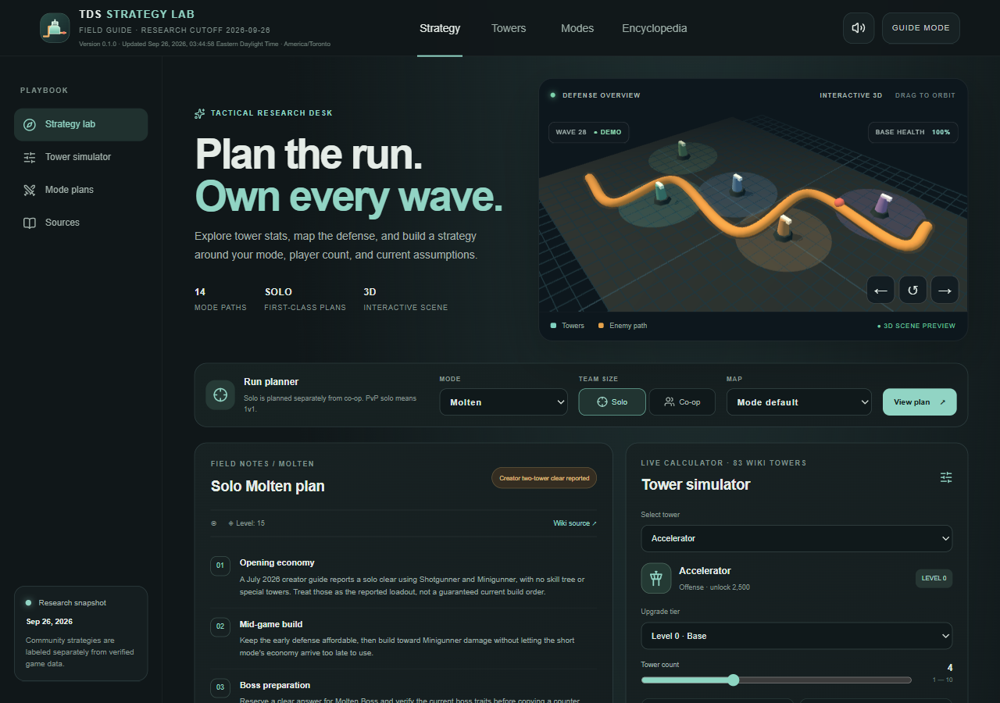
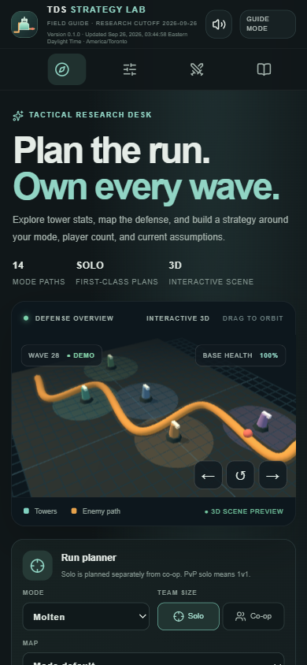

# TDS Strategy Lab

TDS Strategy Lab is a public, source-linked reference and planning tool for Tower Defense Simulator. It combines the current public encyclopedia corpus with a tower-stat simulator, mode-by-mode strategy notes, an original interactive 3D defense scene, and a copy-ready deep-research prompt on the planner.

The live guide is being built and is not published yet.

## Project status

- Source repository: https://github.com/Ding-Ding-Projects/tds-site
- Public guide: pending first verified deployment
- Research cutoff: 2026-09-26
- Current guide coverage and remaining work: [ROADMAP.md](ROADMAP.md)
- Current handoff: [HANDOFF.md](HANDOFF.md)

## Current built experience

These captures show the local production build pinned to the first source revision, with the Solo Molten plan, tower simulator, read-aloud control, and interactive 3D scene. One is a 1280×900 desktop viewport; the other is a 390×844 emulated mobile viewport. Both are dark-theme, English captures from one isolated page target. The mobile capture confirms the horizontal section rail, one-column hero and planner, and no document-width overflow. These are genuine local-build captures, not proof of a live deployment. Capture times, viewport details, SHA-256 values, and verification limits are recorded in [capture metadata](evidence/site/current-build.json). The current source also includes a screen-reader description and switchable 2D schematic for the 3D scene, but these earlier baseline captures do not verify those changes.

The research build uses the Official Tower Defense Simulator Wiki as its primary detailed reference and also records official developer material, creator demonstrations, and community strategies. Game facts and recommendations are labeled separately. Counts are generated from the dated API inventory because the wiki's live header, footer, site statistics, and paginated title list reported different totals on 2026-09-26.

The mode planner includes distinct Solo and Co-op plans for 15 scenarios, with four Solo decision checkpoints for each scenario. Frost's Solo checkpoints separate the Wave 33 mini-boss from the Wave 40 final boss and now include the source-backed lead/hidden summons, firerate debuff, Ice Beacon redirect, and late hidden phase. A September 2026 general-survival role skeleton adds Electroshocker, Ranger, Golden Minigunner, Commander, and DJ Booth as unverified candidates for Casual, Easy, and Intermediate; it is not a mode-specific purchase sequence. Other community loadout candidates for Frost, Fallen, and Hardcore remain visibly unverified. Frost creator demonstrations, disputed Voidcore claims, and the Polluted Wasteland II source conflict retain separate confidence labels and source links. Most plans are not verified wave-by-wave clears. See [solo strategy evidence](docs/research/solo-strategy-evidence.md) and the [strategy guide](docs/strategies/README.md).

The tower calculator includes Tesla's source-listed single-target DPS and a separate maximum-chain estimate using its Smite cycle, alongside source-aware estimates for many other towers. It displays assumptions; maximum-hit counts stay separate from per-target DPS, Tesla's Smite AoE target count is not predicted, Pulse Trooper's Sweeper laser is excluded, and Hallow Punk's burn begins at Level 2. See the [simulator methodology](docs/simulator/README.md). The Solo planner remains distinct from Co-op guidance and includes mode-specific checkpoints; most Solo routes remain unverified wave-by-wave strategies, with evidence labels and sources shown in the planner.

The encyclopedia currently records all 2,836 eligible entries, with source, history, direct current and historical license links, retrieval time, attribution, and per-entry adaptation provenance. The latest page-ID inventory has 2,649 namespace 0 and 187 map IDs. A 2026-09-26 freshness pass found 146 stale source pages; after two pages changed during import, a second refresh and follow-up audit verified all 2,836 revisions current with none stale, missing, new, or integrity-flagged. All 2,649 standard pages have checked-in sanitized readable renders totaling 299,474,375 bytes. The latest render audit reused 2,482 verified files, refreshed 167, and reported zero failures. The article reader loads these revision-matched local files first, so full article structure does not depend on a live wiki request. The 187 map pages use their local source formatter and retain expandable full text. The page header showed 2,638 articles and the MediaWiki siteinfo statistic later reported 2,639; these content-page summaries are recorded separately from the exact paginated inventory. Scripts, styles, hidden challenge markup, and remote image files are removed. Older transcluded-template versions are not archived.

The shared Settings panel now stores a language mode and dialog-emoji preference locally and offers a bounded local JSON import control. English, Cantonese, and bilingual copy is currently limited to that panel. The main planner and encyclopedia are not localized yet, and imported replacements are not applied outside Settings. See the [settings design handoff](design/ui-language-settings.md) and [settings documentation](docs/settings/README.md).

## Content and attribution

Imported article text is adapted into this guide's own navigation and presentation. Each entry records its source title, URL, revision, retrieval date, history link, applicable license, and any adaptation notice. The wiki's current policy distinguishes historical CC BY-SA 3.0 text from newer CC BY-SA 4.0 contributions and licenses media individually. Media without verified reuse terms is linked to its source description instead of redistributed.

TDS Strategy Lab is an independent fan resource and is not affiliated with or endorsed by Paradoxum Games or Roblox. Tower Defense Simulator names and game assets remain their respective owners' property.

## Development

This project uses the Sites Vinext starter and the Sites portable build workflow. Local generated data and build output are documented in `docs/data-pipeline/` and remain reproducible from the public source API. Never put private credentials, private vocabulary data, or unlicensed media in this repository.

## Documentation

- [Documentation index](docs/README.md)
- [Research and source policy](docs/research/README.md)
- [Data pipeline](docs/data-pipeline/README.md)
- [Simulator](docs/simulator/README.md)
- [Strategies](docs/strategies/README.md)
- [User guide and accessibility](docs/guide/README.md)
- [Solo strategy evidence](docs/research/solo-strategy-evidence.md)
