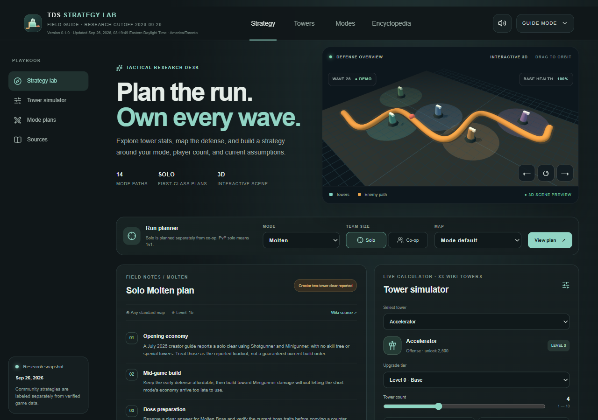
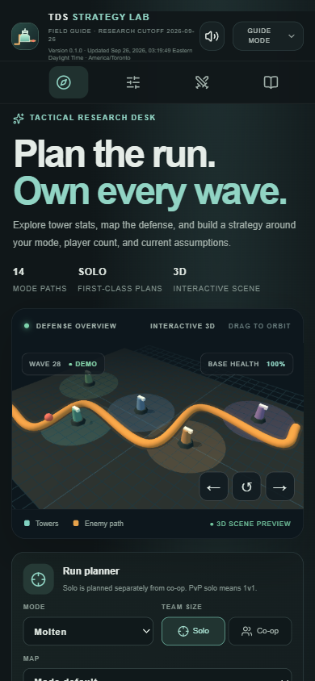

# TDS Strategy Lab

TDS Strategy Lab is a public, source-linked reference and planning tool for Tower Defense Simulator. It combines the current public encyclopedia corpus with a tower-stat simulator, mode-by-mode strategy notes, and an original interactive 3D defense scene.

The live guide is being built and is not published yet.

## Project status

- Source repository: https://github.com/Ding-Ding-Projects/tds-site
- Public guide: pending first verified deployment
- Research cutoff: 2026-09-26
- Current guide coverage and remaining work: [ROADMAP.md](ROADMAP.md)
- Current handoff: [HANDOFF.md](HANDOFF.md)

## Current built experience

These pre-commit captures show the local production build with the Solo Molten plan and interactive 3D scene. One is a 1280×900 desktop viewport; the other is a 390×844 emulated mobile viewport. Both are dark-theme, English captures from a single verified local page target. The mobile capture confirms the horizontal section rail, one-column hero and planner, and no document-width overflow. A read-aloud control and its noninteractive view label were refined afterward, so these pixels are retained as layout evidence, not as a capture of the latest source. Capture times, viewport details, SHA-256 values, and verification limits are recorded in [capture metadata](evidence/site/current-build.json). Refresh them against the published source revision before release.

The research build uses the Official Tower Defense Simulator Wiki as its primary detailed reference and also records official developer material, creator demonstrations, and community strategies. Game facts and recommendations are labeled separately. Counts are generated from the dated API inventory because the wiki's live header, footer, site statistics, and paginated title list reported different totals on 2026-09-26.

The mode planner includes distinct solo notes for 14 mode types and keeps solo evidence separate from co-op assumptions. Frost creator demonstrations, a reported Hardcore loadout, disputed Voidcore claims, and an unverified Polluted Wasteland II solo claim have separate confidence labels and source links. Most other entries are planning checklists, not verified wave-by-wave clears. See [solo strategy evidence](docs/research/solo-strategy-evidence.md).

## Content and attribution

Imported article text is adapted into this guide's own navigation and presentation. Each entry records its source title, URL, revision, retrieval date, history link, applicable license, and any adaptation notice. The wiki's current policy distinguishes historical CC BY-SA 3.0 text from newer CC BY-SA 4.0 contributions and licenses media individually. Media without verified reuse terms is linked to its source description instead of redistributed.

TDS Strategy Lab is an independent fan resource and is not affiliated with or endorsed by Paradoxum Games or Roblox. Tower Defense Simulator names and game assets remain their respective owners' property.

## Development

This project uses the Sites Vinext starter and the Sites portable build workflow. Local generated data and build output are documented in `docs/data-pipeline/` and remain reproducible from the public source API. Never put private credentials, private vocabulary data, or unlicensed media in this repository.

## Documentation

- [Documentation index](docs/README.md)
- [Research and source policy](docs/research/README.md)
- [Data pipeline](docs/data-pipeline/README.md)
- [Simulator](docs/simulator/README.md)
- [Strategies](docs/strategies/README.md)
- [User guide and accessibility](docs/guide/README.md)
- [Solo strategy evidence](docs/research/solo-strategy-evidence.md)
